# Git and GitHub

This module consists of text, graphics, four videos, and three exercises to
get you started using Git and GitHub. Note that the final exercise requires a
colleague to practice collaborating with.


## What are Git and GitHub and how might they be useful?

As a biology graduate student or a professional biologist in a university or
government setting, there are several reasons you might want to use Git and
GitHub. We'll discuss these shortly, but first give two definitions:

`r colorize("GitHub")` refers to the website [github.com](http://github.com){target="_blank"}
where millions of people and companies 'build, ship, and maintain their
software'. This is organised by users having a unique username. For a particular
project, a user creates a `r colorize("repository")`, which is basically a collection of code
needed for that project. Repositories can be public (anyone can see them) or
private (only accessible to users specified by the original owner). Hosting code
in a public GitHub repository allows users to share their code with the world
and collaborate with anyone. The term `r colorize("repository")` is generally used
interchangeably to mean both the collection of code (which includes some files
that Git uses) and the
GitHub website that hosts the collection of code.

`r colorize("Git")` is software that keeps track of the latest versions of your
files on your local computer. Your files can include computer code, data, write-ups of your
work, etc. Git allows you to interact with GitHub to fetch code that others have
changed, and to push your own changes so that others can retrieve
them. Crucially, it allows you to merge each other's changes and easily keep
track of who has done what. It is called a 'version control system', which means
that you can go back to all earlier versions (instances) of your repository --
this is occasionally very useful.

The three main ways that you may want to use Git and GitHub are (starting with
the simplest):

 1. You want do download someone else's code from their GitHub repository.
 2. You want to share your own code on GitHub with others. This will automatically
    include the version control aspect  mentioned above.
 3. You want to collaborate with colleagues on a project.

We will work through these in order, giving more motivation for each as we go
along.

## You just want do download someone else's code from their GitHub repository

Each GitHub repository can be viewed on GitHub. We will first take a five-minute
video tour of a GitHub repository, showing:

 - the layout of the GitHub website of a repository
 - the most useful parts to know about
 - how to download the code if you just want to get it and don't intend to
   collaborate (click the green 'Code' button and 'Download Zip'); useful to get
   the code to a supervisor, say.
 - just download one file by clicking on Raw and then save-as.

So grab some popcorn and watch Video 1:

[](https://www.youtube.com/watch?v=IgwSOxANT08){target="_blank"}

To access a private repository, and for the rest of this module, you will need to set
up a GitHub account:

* Sign up for GitHub at [github.com](http://github.com){target="_blank"}
* If possible, choose a user name that will make sense to colleagues,
  e.g. __andrew-edwards__ or __cgrandin__, not __pink-unicorn__ (such a name may
  make sense to your current colleagues, but you may want something more
  professional so that future colleagues know who you are)
* Desirable: attach a photo (headshot) to your profile. This makes it easy for collaborators to identify you.

For accessing a private repository, your colleague has to invite you from their
GitHub repository page (they would do Settings-Manage access). You will get an
email invitation, and once accepted you will have access to the repository when
you are logged into GitHub.


## Motivation for learning more

The above example is pretty basic. Motivation to learn more comes
from various reasons:

* Scientists (including students) are working far more collaboratively than in the past
* This involves both sharing code and writing up results
* There is a push towards open science -- including your code as part of a scientific paper
* We have called this a [TTT approach](https://waves-vagues.dfo-mpo.gc.ca/Library/40750152.pdf){target="_blank"}:
  + Transparent -- a clear and open way to show data, code, and results, enabling reproducibility
  + Traceable -- a clear link from database queries and code to final results (numbers, tables, and graphs in a document)
  + Transferable -- it should be feasible for another person to reproduce work and build upon it with a minimal learning curve

Using Git and GitHub in your workflow greatly enables this, both when working alone and in a team.
We use them extensively:

* to collaborate on writing code and producing documents (such as this entire
  set of modules!).
* to easily share code and R packages publically for scientific papers, and
  update them as necessary.
* when working alone to retain a methodical workflow.

### Example application -- Pacific Hake stock assessment

Under a formal Agreement between the Canadian and US governments, a team of four
of us (two from each country) conduct an
annual stock assessment for Pacific Hake (_Merluccius productus_) off the west
coast of Canada and the US. The assessment is used to manage the stock, which is of important
ecological and economic value ($100 million export value in Canada).

```{r, echo = FALSE, fig.alt = "Artist rendition of a Pacific Hake.", width="50%", fig.align = "center"}

```

We fit complex population models to data to make projections about future
health of the stock under different levels of catch. There is an extremely short
turnaround (four to five weeks) between getting the final data, doing the analyses
(model runs can take many hours of computer time), resolving new problems, and submitting the
assessment document, which is typically >200 pages and contains numerous figures
and tables [(2021 assessment available
here)](https://media.fisheries.noaa.gov/2021-03/hake-assessment-post-srg-final_20210303.pdf?null){target="_blank"}.

Prior to 2016, the document was assembled in Word, requiring lots of editing
and amaglamating of files, often late at night. Now we share our code via
GitHub and automate a lot of the document production using knitr (similar to
Rmarkdown which is covered in Module 2).

So with four people constantly working on the same large document, we need to
ensure we are keeping up-to-date with each other, can all produce the latest
version, and have `r colorize("identical")` folder structures on each other's
computers. The alternative of emailing files back and forth is:

* very inefficient,
* prone to errors,
* just painful.

### Examples of what we can avoid

Here are some real-world examples from *not* using GitHub, showing what we
can *avoid* when using GitHub.

1. Using GitHub it is easy to see what text/code collaborators have changed, avoiding
things like the following example of Track Changes in Word, for which it hard to see where to get started:

```{r, echo = FALSE, fig.alt = "Example of Track Changes smorgasbord in Word.", out.width="80%", fig.align = "center"}
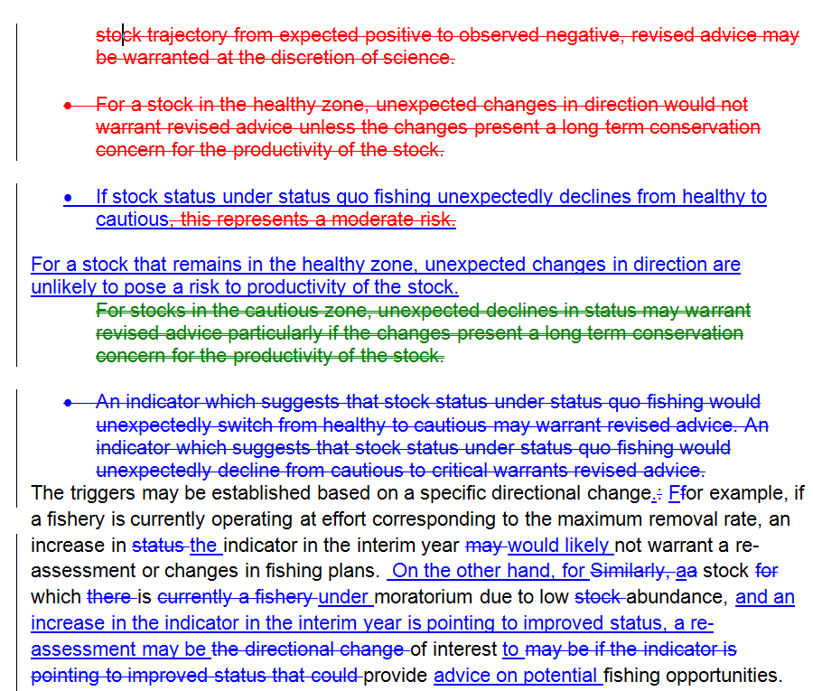
```

2. Often we may want to keep old versions of files (and email them back and forth), but
without GitHub we can end up with a veritable gong show, with multiple saved
versions of the same file:

```{r, echo = FALSE, fig.alt = "Example of having multiple saved versions of a file.", out.width="80%", fig.align = "center"}
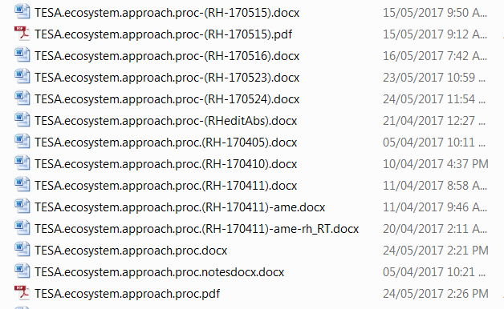
```

3. We can avoid having to manually co-ordinate having only one person working on the latest
version of a document. So we don't get things like this example, which tells me
I shouldn't really do anything now and should wait until others are done merging edits:

```{r, echo = FALSE, fig.alt = "Example of having to wait for colleagues to merge edits.", out.width="90%", fig.align = "center"}
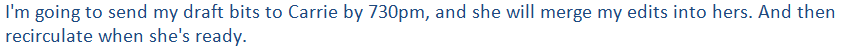
```

4. We can avoid having multiple versions of a file that then have to be carefully merged:

```{r, echo = FALSE, fig.alt = "Example of having to manually manage multiple version of the same document.", out.width="90%", fig.align = "center"}
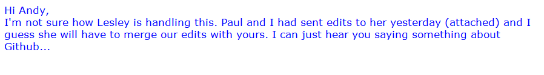
```

While GoogleDocs, for example, is fine for collaborating on a short document, it
isn't suitable for sharing code that needs to be run on your local computer (or
complex code containing files that refer to each other),  or complex documents
that are somewhat automatically updated.

### Example of advantages that arise from using GitHub

1. Say you've off on a two-week hike while your collaborators
have been diligently working away and they have edited 15 new files of code in
five folders, added four data sets, and created five new pages of text towards
a manuscript. With GitHub you can easily
catch up with them (get all their changes onto your computer) with a few
simple commands. You don't even have to pester them to ask what they've done,
as you can check it yourself.

   So rather than this conversation:

   * You: "Hey, I'm back from my awesome trip and saw some bears. What have you
     been doing with the project?"

   * Likely reply: "Glad you had fun. I'm busy on something else right now. Er,
     where were we at when you left?"

   You can have this one:

   * You: "Hey, I'm back from my awesome trip and saw some bears. I went through your
     commits on GitHub and everything looks great. Shall I get on with those
     questions you asked in the GitHub Issues regarding methods?"

   * Likely reply: "Glad you had fun, looking forward to hearing about it. I'm busy
     on something else right now so, yes, resolving those Issues will be great,
     thanks."

   And the project keeps moving in an efficient way. We'll cover GitHub Issues later.


2. By having code shared publicly, it is easy to answer questions, such as
   this one I once received:

```{r, echo = FALSE, fig.alt = "Question someone once had about some code.", out.width="90%", fig.align = "center"}
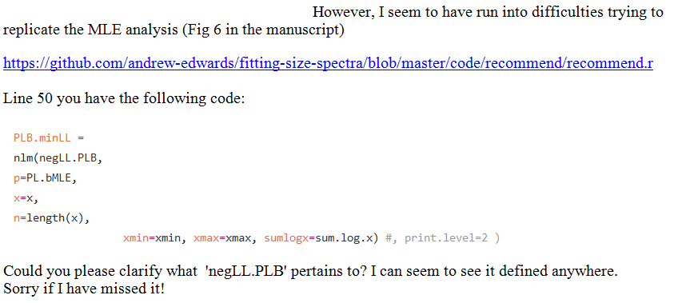
```

   Rather than go searching on my laptop for the code that I hadn't looked at
   for six months, I could immediately open the file (on GitHub) by clicking on the
   link the questioner sent. I could answer very
   quickly, with a simple link to the file I am referring to (there is no ambiguity):

```{r, echo = FALSE, fig.alt = "Reply showing link to code on GitHub.", out.width="70%", fig.align = "center"}
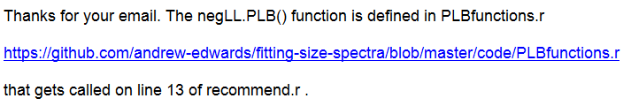
```


3. You can even work out who last edited a particular line of code/text (GitHub
   amusingly calls it 'Blame'). Just open a file on GitHub and click Blame:

```{r, echo = FALSE, fig.alt = "Example of GitHub showing who wrote each last line of a file.", width="130%", fig.align = "center"}
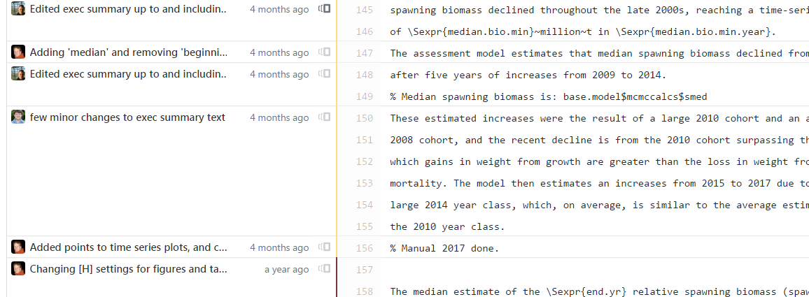
```

   Though you'll often find that it was you all along:

```{r, echo = FALSE, fig.alt = "Very amusing cartoon based on the storyline in every Scooby Doo episode. ", width="100%", fig.align = "center"}
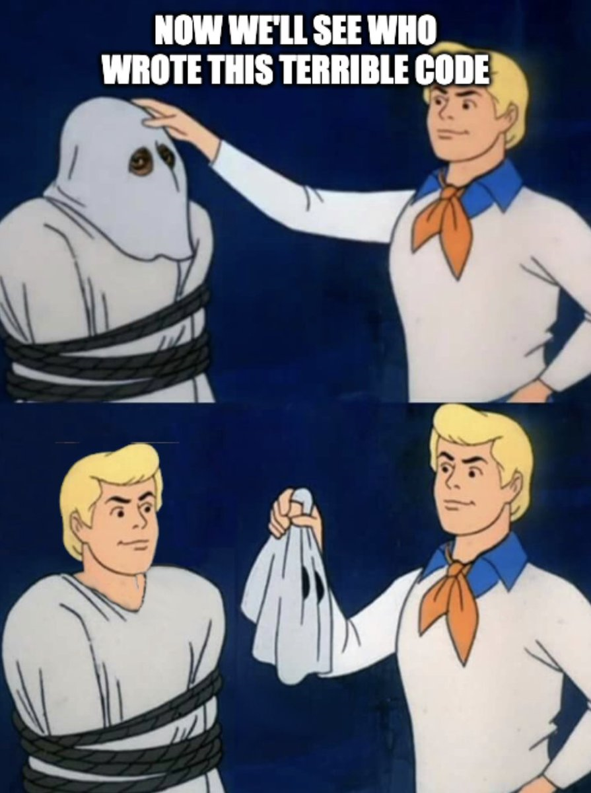
```


4. You can properly keep track of 'Issues' on GitHub (discussed later) to be
   thought about or  fixed, rather than having things in emails that get forgotten:

```{r, echo = FALSE, fig.alt = "Example of GitHub Issues.", width="100%", fig.align = "center"}
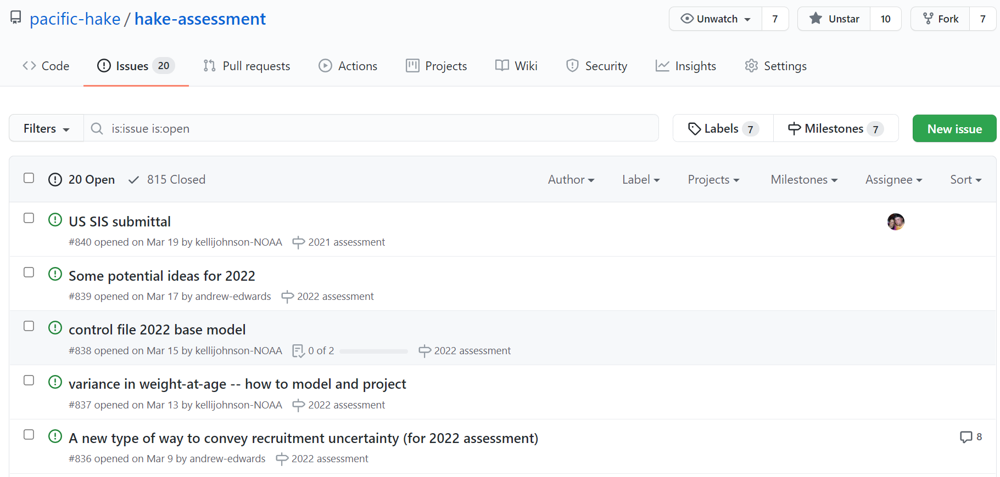
```

5. **Important:** You still have all your work locally on your computer. So if
  your internet access goes down or GitHub is unavailable (which of course will only happen
  when you have a deadline) you can still carry on with your work.


### Why this course?

Delving into the Git and GitHub world online it can feel like you need a
computer science degree to get started. This may not be surprising as Git
was written by the guy who wrote the operating system Linux, to help people
collaborate on writing the operating system Linux. But it means that, for
example, the second paragraph of the Wikipedia Git page says:

"As with most other distributed version control systems, and unlike most
client–server systems, every Git directory on every computer is a full-fledged
repository with complete history and full version-tracking abilities,
independent of network access or a central server."

Say what??? That is fairly incomprehensible to those without strong computer science
backgrounds. The aim of this module is to introduce biologists to the world of
Git and GitHub, while avoiding a lot of the technical details. However, once you
have mastered the basics then it should be easier to delve deeper.

Our target audience is:

* graduate level biology students
* biology faculty
* government scientists
* scientists in non-governmental organisations
* in fact anyone wanting to learn these tools

This work is extended from lectures and exercises developed by Chris Grandin and
myself as part of a
[Fisheries and Oceans Canada workshop](https://github.com/pbs-assess/TTTworkshop){target="_blank"}. (Luckily Chris
_does_ have a computer science degree, and so was able to get some of us going
with Git and GitHub several years ago). These tools are now widely used within
our organisation.

### Does it matter which computer language my code is in?

For sharing code, it doesn't matter what language your code is in (R, Matlab, Python, C,
...), as we will just be sharing text files. There is a learning curve, but once
you get going you only really need a few main commands. Unfortunately the hardest bit is
actually getting everything set up....

## Getting set up for the first time

Before you start using Git you need to set up your computer to use it, and
install a few other programs that are useful.

This is a `r colorize("one-time setup")`
and, although it can sometimes be tricky, once it is done you
will be able to easily create new projects or join others in collaboration.

We have tested the installations as much as feasible. If you have an issue then
search the internet, as it may be due to some configuration on your particular
computer, and installation approaches do get updated.

This module is for any operating system: Windows, MacOS, Linux or Unix.

### What you will end up having installed
These are programs/things you will install. Obviously skip any that you already have working.

* A GitHub account (see earlier for instructions)
* A text editor that isn't Notepad
* Git on your computer

Optional:

* Diffmerge or something similar for comparing changes to files (not completely necessary)
* Markdown Pad 2 or Chrome extension or something similar for viewing Markdown files (not completely necessary)


### Text Editor
You must have a text editor that is aware of outside changes in a file. This is necessary because if you have a file open in the editor and you download an updated version of the file, you want the editor to ask you if you want to use the updated version.

We know that __Emacs__, __Xemacs__ and maybe __Vim__ are okay, as is __RStudio__
for using R (and other) files.

__Notepad__ is not okay. But you can download and install __Notepad++__ which is fine:

https://notepad-plus-plus.org

### Install the Git application on your machine
See https://git-scm.com/downloads for downloading instructions for Windows, MAC and Linux/Unix

It seems best to accept the default options, except:

* default editor: as it says, you probably want to switch from Vim (unless you
use Vim) as the default editor. This option seems to be for the editor that will be
used if Git needs to open a text window for you to edit (which will be rare),
not for editing your own files. Notepad seems fine here if you like.

* 'Adjusting the name of the initial branch in new repositories' - click
 'Override the default branch name for new repositories' and leave it as
 `main`.

### Git shell, GUIs and RStudio
For this course we will use a simple Git shell to type commands (rather than a point-and-click Graphical User Interface). This is for several reasons:

1. Commands are the same across operating systems.
2. It is easier to demonstrate (and remember) a few simple commands, rather than follow a cursor moving across a screen.
3. Learning the text commands will give you a good understanding of how Git and GitHub work.
4. It is easier to Google for help when you get stuck or want to learn about more advanced options.
5. Commands are quick, and you can usually the up arrow (or ctrl-up-arrow) to
   retrieve recent commands, or auto-complete commands using `<TAB>`.

There are many Graphical User Interfaces that are available, as described at https://git-scm.com/downloads/guis.

Many (but not all) biologists use R in RStudio for their analyses. There is Git
functionality built into RStudio that we discuss briefly at the very end of
this module.

I use [magit](https://magit.vc/){target="_blank"} which works in the text editor Emacs (which for years I have used
for pretty much everything, such as editing files, running R, Matlab, etc.). But
I would not have been able to learn magit without first knowing the Git commands
from using the shell, and occasionally need to use the shell to do something
more advanced.

For now we will stick with the Git shell for the aforementioned reasons. It will
also give you a better understanding of Git and GitHub, and emphasise that you
can use Git for any files, not just R code.

### Powershell and posh-git

Download a Powershell (a shell window in which you can type commands, presumably
the 'power' part means it's more powerful than a basic version) and then
posh-git (which adds some extra features). Do this by following the instructions at
https://github.com/dahlbyk/posh-git .

Note that that is a GitHub site -- it is storing the code for `posh-git' (so
anyone can see the code), but when you scroll down you see instructions (like in
the repository example in Video 1).

Do the 'Installation' and 'Using posh-git' sections. If you don't understand
some options (I don't!) just pick the simplest, usually the first.

### Create a directory to keep all your Git-tracked work

It is handy, but not essential, to keep directories that you are tracking
with Git and GitHub all under a single directory; it's a helpful way of
reminding you that you are tracking such directories with Git.

You can use something like `C:\github` (Windows) or `~/github` (Mac) or whatever
you like, but make sure there are no spaces or special characters anywhere in
the full path.

So create such a directory. You will navigate to it later when using Git.

### Install Diffmerge (optional)

A differing tool can be used to examine differences between different versions of
files. There are
many programs that can be used but for consistency we will use Diffmerge.

It is nice to have but not essential if you have trouble installing it.

Install Diffmerge: https://sourcegear.com/diffmerge/downloads.php

### Save our template _.gitconfig_ file

* Git uses a configuration file (called _.gitconfig_) for your account info, name to use when
  committing, aliases (shortcuts) for commands, and other things.
* We are supplying a template _.gitconfig_ file that you will then edit.
* For Windows, you will save it as
  `C:\Users\YOUR-COMPUTER-USER-NAME\.gitconfig`, where YOUR-COMPUTER-USER-NAME
  is your username on your computer.
* For MAC and Linux (we think), you will save it as `~/.gitconfig`.
* If there is already such a file there maybe save a copy of it under a
  different name so you don't completely overwrite it in the next step.
* The template file is on GitHub
  [here](https://raw.githubusercontent.com/quantitative-biology/module-1-git/main/misc/.gitconfig){target="_blank"}. Do
  `Save-As` (right click or from a menu) and save the file as the filename mentioned above.
* Just a reminder for your understanding: that file on GitHub is
  shown in the normal way on the Github repository for this module:
  https://github.com/quantitative-biology/module-1-git/blob/main/misc/.gitconfig
  and the link we gave you is from clicking `Raw', which just gives you the raw
  code for the file -- this works for any file on GitHub, as mentioned in Video 1.

### Edit the _.gitconfig_ file

* Use your text editor to open your saved _.gitconfig_ file. Given it has a non-standard
  extension (i.e. it is not something like *file.txt*) you may have to specify
  to open it with your editor.
* Change the [user] name and email settings to reflect your information.
* Change the [difftool] and [diffmerge] directories so they point to the
  location where you have DiffMerge (if it installed okay).
  * For Windows the location should be: `C:\Program Files\SourceGear\Common\DiffMerge\sgdm.exe`
  * For MAC the location should be: `/usr/local/bin/diffmerge`
* If you did not install Diffmerge then delete the nine lines from `[diff]` down
  to `   trustExitCode = true` in your _.gitconfig_ file.

### GitHub authorisation

You will use Git to communicate back and forth with your repository on the
GitHub website. You don't want to have to enter a password every time. This
is currently done by creating something called a Personal Access Token (PAT).

If using R then do:
```
install.packages("usethis")    # Unless you already have the usethis pacakge
install.packages("gitcreds")   # Unless you already have the gitcreds pacakge
usethis::create_github_token() # This opens up GitHub in your browser to set up
                               #  a PAT token. Copy and paste the next line into
							   #  R and then complete the setup on GitHub
							   #  (stick with defaults), copying the resulting
							   #  PAT token to your clipboard.
gitcreds::gitcreds_set()       # Paste the PAT token from the clipboard as
							   #  requested.
```

This seems to be the simplest method. If you don't use R then either

1. Install R [from here](https://www.r-project.org/){target="_blank"} and just copy the above
lines into an R window. It obviously may seem overkill to install R just to set
up something else, but the PAT stuff is fairly new, and the R route is fairly
straightforward.

2. Else, try [these
instructions](https://docs.github.com/en/authentication/keeping-your-account-and-data-secure/creating-a-personal-access-token){target="_blank"}. They
mention that you may be asked for your PAT the first time you use
Git (with the `git clone` command you will see soon), and that your PAT may get
cached (meaning you don't have to keep entering it every time you interact with
GitHub). If you repeatedly get asked for your PAT then see the instructions at
the bottom of that page regarding caching your credentials.

### Navigating in a shell

You need to know how to change directories in the Git shell. This is like
clicking on folders or going back in File Explorer (Windows) or Finder
(Mac). Bascially you use

`cd <dir.name>`

to change directory (move into that directory),

`cd ..`

to go back up again, and

`dir` (on Windows) or

`ls` (on Mac)

to list the contents (either command works for Linux). These are shown in the
following screenshot, for which I opened up my Git
shell in Windows and did the above commands,
moving into the `test` directory, seeing what's there, and then moving back up:

```{r, echo = FALSE, fig.alt = "Screenshot of basic shell commands.", width="100%", fig.align = "center"}
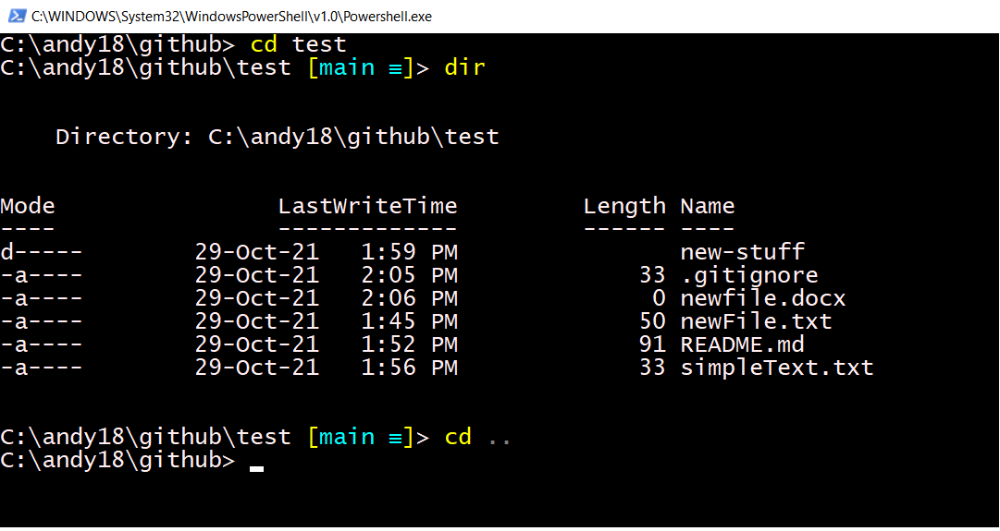
```

You will create such a `test` directory during Video 2.

### One-time authentication

The first time you get set up or start using Git, there might be some one-time
authentication to connect to your GitHub account. For
example, in Windows you might be asked to type

`git config --global credential.helper wincred`

in the Git shell. So just follow any instructions if they come up.

### MAC only: make your output pretty
On the MAC, navigate to the `~/github` directory in a shell and run the following command:

`git config --global color.ui.auto`

This will make your git output colored in a similar way to the Windows powershell version.


### Something to view Markdown files (optional)

Each project has an associated *README.md* file that appears on its GitHub
homepage. The extension `.md` stands for Markdown and is just an ASCii text file
that contains simple formatting (such as bold or italics). You can edit the file
in any text editor. There are two options we have used to view the rendered
versions of markdown files (rendered means it utilises the formatting you have
coded). Choose one:

* The Markdown Pad 2 editor/viewer which is easy to use: http://markdownpad.com. Just get the free version.
* The Chrome extension for markdown viewing: https://chrome.google.com/webstore/detail/markdown-viewer/ckkdlimhmcjmikdlpkmbgfkaikojcbjk?hl=en.

Here is an intuitive short introduction to Markdown, which is worth looking at
once you start writing more in your *README.md* files:
https://github.com/adam-p/markdown-here/wiki/Markdown-Cheatsheet.

With one of the above two options installed when you click on a *README.md* file
you can edit the file and also see the rendered (formatted) version. I find that
Markdown Pad 2 doesn't show (render) the *README.md* file exactly the same way as it
appears on the GitHub website, with the GitHub version being better.

### Bonus keyboard shortcut (optional)

In the upcoming Video 2, I may occasionally type `g` instead of `git` as I have that shortcut
set up. To enable this shortcut for yourself (this is not essential), create a
file (on Windows at least) called *g.bat*
somewhere on your PATH, and have it contain just the line `git %*`.

## Using Git and GitHub to share your own code

This section shows how to use Git to efficiently save ongoing versions of your files and
GitHub to share them. This is the crux of this module. It consists of Video 2
where I demonstrate how to use Git and GitHub. You can pause the video at the
suggested moments to repeat what was demonstrated. Two exercises are included.

The notes below repeat the details from the video, so you can easily refer to
them later (without having to search within the video). The slides that I show
are also available [here](https://github.com/quantitative-biology/module-1-git/blob/main/git-intro/git-course-intro.pdf){target="_blank"} (though the notes below mostly replicate the slides).

Okay, now for Video 2:

[](https://www.youtube.com/watch?v=2UYnVIg-Dws){target="_blank"}

### Definitions

Let's recall the main definitions:

* Repository -- essentially a directory containing all your files for a
    project (plus some files that Git uses). Also used to mean the website on GitHub.
* Git -- a program that allows you to efficiently save ongoing versions of
    your files (`version control') and link with GitHub.
* GitHub -- a website that hosts your repositories so that you can easily
   share code and collaborate with colleagues.

Basically, the idea is that you work on your files in a repository on your computer, use Git on
your computer when you are happy to keep your changes, and use GitHub to easily
share the files.

In the opening video you learnt how to navigate a repository on GitHub and how
to download other people's code Here you will learn the important steps for your
own repositories:

* Creating -- create a new repository on GitHub
* Cloning -- copying it to your local computer
* Committing -- the crux of working with Git
* Collaborating -- efficiently work with colleagues
* Conflicts -- fixing conflicting changes when collaborating (happens rarely)

### Creating a new repository
* Sign into your GitHub account, click on the _Repositories_ tab, and press the _New_ button.
* Give your repository a name. Let's call it test.
* Check _Initialize_ this _repository_ with a _README_.
* Leave _Add .gitignore_ and _Add a license_ set to _None_
* Click _Create repository_.

You now have a new repository on the GitHub website. Next we will clone it onto your computer.

### Cloning your new repository

* Copy the full URL (web address) of your test repository.
* Open the Git shell and navigate to your `C:/github` directory (or whatever you
  called it when you created it in the setup instructions -- it's the place you
  are going to save all your Git repositories). See the 'Navigating in a shell'
  section earlier.
* Run the following command to _clone_ your repository:

`git clone URL`

where URL is the url of your newly created repository (paste should work).

You should now have a subdirectory called `github/test` on your computer.
In Git shell, change to that directory (with `cd test`). The command `cd` just
stands for `change directory`, to go back to where you were just do `cd ..`. You
probably want to also open the directory using your usual graphical interface (e.g. File Explorer
in Windows) to check what is happening.

So 'clone' is Git speak for copying something from GitHub onto your local
computer. This example has just one file (_README.md_). But the process is the
same for a repository with multiple files and multiple directories, and the
complate file sturcture is fully preserved.

**Windows only: Storing your credentials**

When you are using the Git shell for the very first time on Windows, issue the following command:

`git config --global credential.helper wincred`

This means that you don't have to repeatedly enter you GitHub password (just do it when you are first prompted).

### Committing

* Create a new file, _newFile.txt_, in the `github/test` directory.
* Open it, add a line of text at the start of the file and save it.
* Check the status of your (test) repository:

`git status`

* It should say that you have an 'Untracked file' called _newFile.txt_. You want
  to tell Git to start tracking it, by using:

`git add. gitignore`

* Type `git status` again.
* You should see that the file is listed as a 'new file' under 'Changes to be commited'.
* Let's now 'commit' it:

`git commit -a -m "Add newFile.txt."`

The commit message (in the quotes) should be a useful message saying what the
commit encapsulates (more on that later).

* Push the commit to GitHub:

`git push`

* Check (refresh) the GitHub webpage and see your commit and the uploaded file.

**What just happened?**

We just used three of the main Git commands:

* `git add <filename>` -- tell Git to start keeping track of changes to this file. You only need to tell Git this once.
* `git commit -a -m "Message."` -- committing your changes, which means tell Git you are happy with your edits and want to save them.
* `git push` -- this sends your commit to the GitHub website.

You always have your files stored locally on your computer (as usual), even if you don't add them or commit changes.

When you push to GitHub then your colleagues can easily fetch (retrieve) them.

**Keyboard aliases (shortcuts)**

Now,

`git commit -a -m "Message."`

is a bit much to type, so we have an alias for it:

`git com "Message."`

This is defined in the _.gitconfig_ file you installed in the `git-setup`
instructions into `C:\Users\YOUR-USER-NAME\.gitconfig` (for Windows). You can
also add your own commands to that file.

The `-a` means 'commit all changes of files that Git is tracking', and `-m` is
to include a message. Since we usually want to do both of these,
`git com "Message."` is a useful shortcut. But it is important to realise it is an alias if searching online for help.

Similarly:

`git s` -- for `git status`

`git p` -- for `git push`

`git d` -- for `git diff`

`git f` -- for `git fetch`

From now on we will mostly use the aliases. Use the full commands if the
_.gitconfig_ file didn't work for you.


**Edit _Readme.md_**

Edit the _Readme.md_ file. Add some simple comments describing the project such as: "A test repository for learning Git."

Look over the changes, commit them, and push them to your GitHub repository:

`git s`

`git d` (or `git diff`) -- this gives a simple look at the differences between
the last committed version and your current version (of all files; only one in
this case).

`git com` "Initial edit of Readme.md"

`git p` (or `git push`)

Refresh your GitHub web page and you should see your text (the _Readme.md_ file is what is shown on the main page of your repo).

If you got Diffmerge installed okay, then instead of `git diff` you can do `git
difftool`. This opens up, in turn, each file that changed since your last commit
and shows you the differences. On the right is the new text (actually the code
for this paragraph):

```{r, echo = FALSE, fig.alt = "Screenshot of using git difftool.", width="100%", fig.align = "center"}
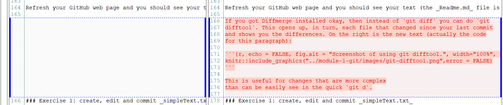
```

This is useful for changes that are more complex
than can be easily see in the quick `git d`.

### Exercise 1: create, edit and commit _simpleText.txt_

1. Create a text file _simpleText.txt_ in  your local `test` repository. Add a
   line of text at the start and save it.
2. Predict what `git s` will tell you, then type it in the Git shell to check.
3. Add the file to the repository using the git commands:

`git add simpleText.txt`

`git s` -- not necessary but useful to check you understand what is changing before you commit

`git com "Adding simpleText.txt"`

`git p`

4. Add some more test to _simpleText.txt_ then `git com "Message."` and `git p`.
5. Repeat this a few times to get the hang of it. `git com` frequently and `git
   p` occasionally (you do not have to push every commit), while intermittently doing `git s` and `git d` to understand what's changing.
6. Keep an eye on your commits by refreshing the GitHub page.

In reality when writing code/text you won't be committing quite so frequently,
as your focus will be on the writing the actual code/text.

**Adding multiple files at once**

Often you add multiple files in a new directory. When you run `git s`, you will
see a large list of _Untracked files_. They can be all added at once by simply
adding the whole directory.

### Exercise 2: multiple files

Do the following, to get the idea of creating multiple files in a folder and
committing that folder.

* Create a new directory called _new-stuff_ in your `test` repository, using your normal method
  (e.g. in File Explorer, or just `mkdir new-stuff` in the shell). Navigate to
  it in your shell (`cd new-stuff`).
* Add a few new test files to that directory called _test1.txt_, _test2.txt_,
  etc. Put some example text in one or more of them if you want.
* On the command line, check the status:

`git s`

* You will see a listing showing the _new-stuff/_ directory in _Untracked files_.
* To add all the new files in preparation for a commit, issue the command:
`git add new-stuff/`

* Check the status of the repository again with `git s`
* It will now show all files in _Changes to be committed_
* Commit the changes:

`git com "Added new-stuff directory."`

* Push the changes to GitHub:

`git p`

* Check your GitHub webpage and see your commit and that the files have been uploaded.
* That works no matter how many files are in your new-stuff directory. There
  could be a hundred and it's the same command.

**Wildcard symbol `*`**

This is useful to know (no need to do it as part of the exercise):

* To add multiple files with similar names you can use the wildcard `*` symbol.
* You just added (told Git to keep track of) the new files in your _new-stuff/_ directory.
* If you add more new files to that directory, you will have to tell Git to
  track those also. This is because they are new -- you haven't told Git about them yet.
* Say you have 10 new files called _idea1.txt_, _idea2.txt_, ..., _idea 10.txt_.
* Instead of typing

`git add new-stuff/idea1.txt`

`git add new-stuff/idea2.txt`

etc. you can just use the wildcard symbol `*` which stands for any piece of text:

`git add new-stuff/idea*.txt`

or even just

`git add new-stuff/*.txt`

or

`git add new-stuff/*.*`.

**The _.gitignore_ file**

But what if you don't want to add all the files that you create?

Each repository can have a _.gitignore_ file, in the root directory of the repository.
Such a file has names of files (such as _my-secret-notes.txt_) or wildcard names
(such as `*.pdf` or `*.doc`) that will be completely ignored by Git.

For an example, see
[https://github.com/pacific-hake/hake-assessment/blob/master/.gitignore](https://github.com/pacific-hake/hake-assessment/blob/master/.gitignore){target="_blank"},
noting that the `#` can be used for comments.


When sharing a repository with others, you want to share your _code_ (for
example, R, Python or Matlab code) and maybe data, but generally _not_ share the
output (such as figures that the code generates; more on this later). For
reproducible research your colleague (or anyone) should be able to run your code
to generate the results.

Some programs you run may make temporary files that don't need to be tracked by
Git, the names of which should also be included in your _.gitignore_.

When sharing code or collaborating you want to keep your repository as clean as
possible and not clutter it up with files that other people don't need.

So when you run `git s` and see untracked files that you don't want to be
tracked, add them (or a suitable wildcard expression) to your _.gitignore_ file
so that they are not added inadvertently.

This will also simplify your workflow (you don't need to keep being reminded
that you have untracked files).

If you are on MacOS and you find that folders have a _.DS\_Store_ file in them,
then include _.DS\_Store_ as a line in your _.gitignore_ file.

Generally, when you create a new repository you probably want to copy an
existing _.gitignore_ file over from an existing repository, as you will
generally want to ignore the same types of files.

You can also choose the _private repository_ option when creating a repository,
so that you can control who can see it. On your repository page on GitHub, go to
`Settings--Manage Access` to add collaborators.

### What to write in commit messages

You don't want to agonise over what you write in your commit messages, when
doing `git com "Message"`, but it is worthwhile making them useful. Ideally

* You want to describe *what* (and sometimes *why*) you did something.
* The *how* is not needed since that will be explained by the actual
    changes in the code. If someone wants to see how something was done, they
    can see what was changed in detail in the commit.
* The message should be informative for collaborators (including your future self).

`r colorize("Not useful:")`

`git com "Tweaked function."`

`r colorize("Useful:")`

`git com "Allow plot.biomass() to use extra colours."`

A good rule of thumb is to just complete the sentence "`r colorize("This commit will ...")`".

This is helpful for your collaborators and your future self.

You have now learnt the basics of using Git. By creating a public repository on
GitHub you can now release your code to the world!

## Using Git and GitHub to collaborate with colleagues

### Demonstration of collaborating

Now we will show how to collaborate with colleagues, which is where the
usefulness of GitHub will become more apparent.

There are a few different ways to collaborate using Git and GitHub. We will
focus on the following one since it is the simplest, and is what you need to
collaborate with colleagues.

Concept: there is a project where people contribute to a main repository that is
considered the 'master copy'.

* Everyone clones directly from the creator's repository.
* All collaborators push their commits to the repository (the creator has
  to add them as collaborators once on GitHub).

Since the creator has to grant permission, you won't have just anyone
contributing to (and maybe messing up your work), just your trusted collaborators.

But you have to trust your team to not mess things up (more on that later).

In Video 3 we demonstrate the following (skip these bullet points if you don't
like spoilers!):

* Kim creates new repo called `collaborate` (and clones it to her computer).
* Andy clones it also.
* On GitHub, Kim gives Andy 'push access' to her `collaborate` repo.
* Both do some edits (create some new simple text files).
* For Andy to get Kim's updates (and vice versa), he just uses:

  + `git fetch` (or just `git f`) -- fetches the latest version of the repository from GitHub onto your computer. Your local files have _not_ yet changed (check them), but Git has the changes stored on your computer (?!?).
  + `git rebase` -- updates your local repository (the committed files on your computer) with the changes you have just fetched, merging both people's work together.
  + `git p` -- pushes the merged changes back up to GitHub so that the other person can get them.

That is the basic workflow. Here is Video 3:

[](https://www.youtube.com/watch?v=v4DHTEP5ifQ){target="_blank"}

In the video you saw that we also showed an example of `git p` _not_ being allowed for Person A  because
there are recent commits on GitHub (by Person B) that Person A has not yet
merged into their local version of the repository.

Here is an example of the error message you get:

```{r, echo = FALSE, fig.alt = "Example of a lengthy error message when trying to push; essentially its just telling you to pull before trying to push.", width="100%", fig.align = "center"}
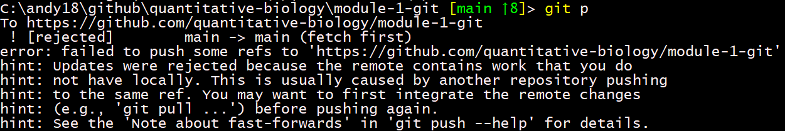
```

While a bit lengthy, the error message is useful. It forces you to get the other
person's work before you push yours. You do this by:

`git f`
`git rebase`.

So to be allowed to push, just `fetch` to get the new commits onto your computer,
and then `rebase` to combine the commits into your local version. Then you can

`git push`.

Here is a full screenshot ('g' is just a shortcut for 'git'). The green up arrow
number 8 tells me I have 8 commits to push to GitHub. It's generally good to
skim the white output text to check that Git did not give an error. The yellow
arrows I think
of as just implying I need to do a rebase (before doing that I would usually browse
through the other person's commits on GitHub to check what they did):

```{r, echo = FALSE, fig.alt = "Example of output when having 8 commits to push but then having to fetch and then rebase.", width="100%", fig.align = "center"}
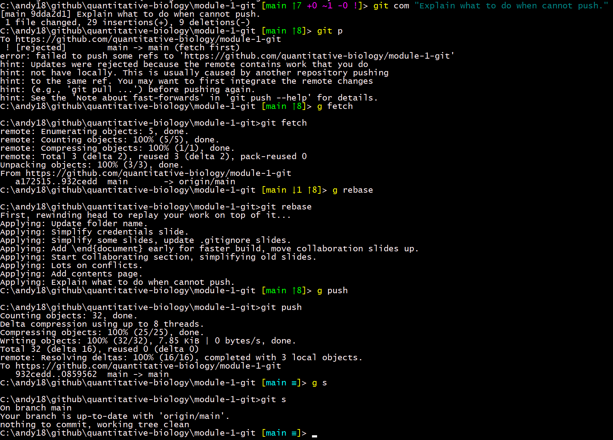
```

After the `rebase` I was allowed to `push` and then everything is up to date.

### A bit more about git rebase

* Andy commits local changes, tries to `git push` but is told to first `git fetch` (to get Kim's changes from GitHub).
* Andy does `git fetch` and then `git rebase`.
* What `git rebase` does is basically rewind to the last common commit that both
  people had, and then add one person's commits and the others.
* Andy then does `git push` to push his commits to GitHub (from where Kim will fetch them when she's ready).
* Providing there are no conflicts, this will work fine.

Another option you hear about is to do a `git merge`, which basically creates a new commit that merges both people's work together.
In our teams we used to use `git merge` and now use `git rebase`; some people don't
like `git merge` because it adds extra commits.

For a more in-depth understanding [see here](https://reflectoring.io/git-rebase-merge/){target="_blank"} for one of the clearer explanations out there concerning rebase versus merge.

Note that the error in the above screenshot (when I could not `git push`) told
me that I might want to do `git pull`. This is basically

`git fetch`

`git merge`

in one command, but it seems preferable to do

`git fetch`

`git rebase`.

### Fixing a conflict

* A `r colorize("conflict")` happens when two people have edited the `r colorize("same line(s) of the same
  file")`.
* Conflicts happen relatively rarely and can be generally avoided by
  co-ordinating with collaborators so that you are working on different
  files. But, they will happen and you need to know how to resolve them.
* Git _forces_ you to explicitly decide whose changes to keep -- this is a `r colorize("good")`
  thing, since you want a human to make such a decision.

In Video 4 we demonstrate a conflict, and fix it using the following (which is
the best approach we have found):

* Trying `git rebase` will tell you there is a conflict.
* `git rebase --abort` -- do this to abort the rebase attempt.
* `git merge` -- this will tell you there is a conflict and which files are
  conflicting.
* Open the file(s) with the conflict and edit the text. You will see the conflicted section bracketed like this:
```
<<<<<<< HEAD
Line(s) of text/code which are currently in your file.
=======
Line(s) of text/code which are trying to merge in, but conflict.
>>>>>> origin/main
```
* Note that `origin/main` refers to the version you have fetched from GitHub.
* Remove the line(s) of text that you do not want to keep (or edit
the line(s) to be something else entirely), and remove the bracketing lines
`<<<...` and `>>>...`, and the ` ======` line (this is all shown in the
video). Save the file(s).
* `git add <filename(s)>` -- you have to then add the file(s) that had the conflict (I am not sure why this is necessary, I just do it).
* `git com "<message>"` -- in your commit message you can explain why you fixed
  the conflict. For example: `git com "Kept Kim's edits as more consistent with
  remaining text."`  This is useful so that your collaborators know you have resolved
  a conflict (they can look at the commit to see if they are happy with it).

Here is Video 4:

[](https://www.youtube.com/watch?v=wA4SP6ekiC0){target="_blank"}

### Exercise 3: collaborating on a single repository

If you have a colleague available, try what we just did:

* Person 1 creates a new repository on GitHub and clone to their computer.
* Give the Person 2 'push access' to the repository (on the repo page on GitHub: Settings -- Manage access -- Invite a collaborator)
* Person 2 clones to their computer
* Both create a simple text file (use different filenames), add some text and, as usual, `add`, `commit`, and `push`.
* `git fetch` and `git rebase` to get the other person's file.
* Continue editing either file, committing, and pushing.
* If you get the push error (shown earlier), refresh GitHub repository site to
  see recent commits (click on the X commits link, where X shows the total
  number of commits to the repository). You can easily spot the
  other person's recent commits. Click on one (the bold message) to see
  details.
* Purposefully create a conflict (both edit the same line of the same
  file). Resolve it as described earlier.
* In practice you won't commit so frequently when working, but this is good to get the hang of it.

### Collaborating summary

Congratulations, you now know the few basic commands and functionality needed to collaborate with Git and GitHub.
It takes a bit of practice, but it is very powerful.

`r colorize("95% of the time, this is all you are doing:")`

* Change some code.

```
git s
git d
git  com "My commit message"`
git p
```

(the `git s` and `git d` are useful to check you have changed only what you think you have changed).

If GitHub does not allow you to push then on GitHub check your colleague's latest commits
that you haven't yet seen, and if they look fine then:
```
git fetch
git rebase
```

(If you don't agree with your colleague's latest commits, then still rebase them
but then manually edit the files to be what you want. Though if you want to completely
cancel their commits see `git revert` in the Advanced section below).

If conflicts, then

```
git rebase --abort
git merge
```

fix the conflicts manually and then

```
git add <conflicted file(s)>
git com "Message to explain what you did"
git p
```

Change some code and repeat!

## Workflow tips when collaborating

Here are some tips that we've developed based on our own experiences.

Overall, remember that you still edit and save your files in the usual way on your
  local computer. If you don't do Git commits you will still have the `r colorize("latest versions
  of your files on your computer")`, as you would if you weren't using Git at all. So if
  you do get stuck with Git you can carry on working as normal (though you
  probably do want to try and fix it at some point).

When collaborating:

* If working closely with others, when you start each day (or after a break)
  then make sure you are up to date and have all their commits. Refresh the
  GitHub page for you repository, and `git fetch` (or just `git f`) and `git clone` if needed. (To
  be safe you can `git f` and `git s` to check).
* We find it helpful to co-ordinate our work (Slack is useful for this, or use
  GitHub Issues for complex discussion -- see below), so that if multiple people
  are working at the same time, you are at least not working on exactly the same
  parts, just to reduce conflicts.
* Commit fairly frequently and write helpful commit messages (so your colleagues
  get an idea of what you've done in each commit). Push less frequently, and
  _don't push code that doesn't work_ -- that will annoy your colleagues. And
  then they (and probably you) may both spend time fixing it.
* To see who last edited a particular piece of code, when viewing the file on
  GitHub click `r colorize("Blame")`, as mentioned earlier.

**GitHub Issues**

GitHub _Issues_ are very useful for discussing issues with your repo. For our
annual Pacific Hake assessment we have used them extensively over the years:

```{r, echo = FALSE, fig.alt = "Example screenshot of GitHub Issues, click on Issues in any repository in GitHub to see more.", width="100%", fig.align = "center"}

```

The Issues tab lists our current 'Open' issues -- we have 20, of which five (the
most recently posted) are
shown here. We are currently in-between assessments (and not working on it), so
we have created Issues that we want to think about or deal with for next
year. This avoids forgetting about ideas or losing them in old emails.

Issues are intuitive to use. There is a bright green 'New Issues' button to
create new ones, you give a title and then write some details, people can reply,
you can assign people to look at them, and you can close them. In the above
screenshot you can see that we have closed 815 issues (this was over several years).

Useful tip: when doing a commit that refers to an Issue, if you refer to the
Issue number (with `#<number>`) in your commit message, then after pushing that commit the Issue on
GitHub will automatically mention and link to the commit:

`git com "Add more options to fancy_function(), #21."`

will mention the commit when you look at the issue. You can even automatically
close the issue by saying `closes #21` in your commit message:

`git com "Add more options to fancy_function(), closes #21."`

Issues are particularly useful to avoid cluttering up code with commented notes
or ideas that you may easily not come back to, or avoiding endless emails that
end up getting overlooked. You don't have to fix an Issue to close it, you can
decide not to pursue, but at least you have made a decision.

(We also use Slack a lot to communicate, but moreso for quick questions or
bouncing ideas around -- Issues are better for stuff that you want to come back
to at some point).

You may receive emails regarding Issues. If you use GitHub a lot you will
spot Notifications (the blue dot on the bell in the top-right corner when signed
in on GitHub) that
will show you new Issues of repositories you are involved with, or if anyone has
updated an Issue. You can then turn off the email notifications.


**GitHub organizations**

If you will frequently collaborate with colleagues, you can create an
Organization on GitHub and invite collaborators to it (click on your GitHub
photo in the top-right corner, Settings, Organizations). Then they will
automatically have access to all repositories created under the
Organization. You can choose the security settings.

So, congratulations for getting this far -- we have covered the basics of Git
and GitHub to get you going. Occasionally you might get messed up, but it is
generally hard to actually lose any work. If you get stuck then see 'The power to go
back' part of the next section, that contains more advanced material. Good luck
and happy committing!

## Beyond the basics of Git and GitHub -- getting more advanced

This section gives slightly more advanced background that should further improve
your understanding (including why Git is useful even when not collaborating or
sharing your code).
If you're doing this module for the first time maybe read this section now so
that you know what is here, but don't worry
about understanding it all until you have become more familiar with using Git and GitHub.

### So I've made some changes but don't really want to keep them -- git stash

If you've changed some code but _have not committed it_, and then maybe got in a
mess and just want to go back to your last commit, you can _stash_ your changes
```
git stash
```
and to include a message (for your future self):
```
git stash save "Message"
```

This stashes them away such that they can be retrieved later if necessary.
This is handy. You may _think_ you don't want to keep those changes, but
sometimes you may later wish you had kept them somehwere.
Note this is only for files that Git is tracking (i.e. files that have been added
at some point).

To retrieve the last stash, you 'pop' them back into your working copy with:
`git stash pop`

You can have multiple stashes, seen by doing:
```
git stash list
```
To deal with these, and other aspects of `stash`, see [this tutorial](https://www.atlassian.com/git/tutorials/saving-changes/git-stash){target="_blank"}.

If you are really really sure that you do not want to keep your recent changes,
see the 'Undoing changes not yet committed' section near the end of this module.

### The power to go back

With Git you can revert back to any previous state of your repository.
This is `r colorize("very powerful")`, though slightly
`r colorize("scary")` at first.

Do this with your test repository, that should have some files in it from the
  earlier excercise:

* `git s` to make sure you are all up-to-date
      (`commit` and/or `push` if necessary).
* In File Explorer (or whatever you use) look at your repository, you should see
    all your files, including the `new-stuff\` directory.
* Look at the commit tab on GitHub for your test repo and click on the clipboard
      icon to copy the HASH number thingy to the clipboard .
* In Git shell: `git checkout HASH` (where `HASH` is the pasted HASH, or `git co
  HASH` using our Alias)
* Look at File Explorer again -- your `new-stuff` directory should
      have ... disappeared!!
* (If it hasn't disappeared then open it -- the test files, i.e. `test1.r`,
      `test2.r`, etc. should be gone, but your text editor may
      have saved backup versions; manually delete them plus the
      `new-stuff/` directory.)
* You are now back to the very first version of your repo!

Powerful and scary.

Now, to get your files back to the most recent version you had committed:

* `git checkout main`   (it used to be `git checkout master`, the names have recently changed).

That's it! Check that your files are back. All this means that you can
`r colorize("revert to any previous commit in your repository")`.

This is very reassuring. For example you have some complex code that you realise
  is now a complete mess and you want to go back to yesterday's version of everything.

In practice you rarely actually do this, but it's very comforting to know
  that you can.

Consequently, your workflow is less cluttered and more tractable than having
  to save multiple versions of the same files with dates in the filename, such
  as this nightmare:

```{r, echo = FALSE, fig.alt = "Example showing multiple saved versions of the same file, to show what you can avoid by using Git.", width="100%", fig.align = "center"}

```

**Retrieving older work in practice**

I think there are fancy ways that Git can replace a current file with a version
from an earlier commit. But, in practice (especially since you rarely want to do
this) it is a bit safer to do the following:

* Say you are up-to-date (`git s` says all is good), but your program
  `my_code.R` just isn't working and you want to go back to the version you had
  yesterday at commit number `abc123`.
* `git co abc123` (or `git checkout abc123`) to checkout the earlier commit,
  which includes the old version of `my_code.R` that you want get.
* Copy `my_code.R` to a new file `my_code_old.R`. In the shell you can just do
  this with `cp my_code.R my_code_old.R`.
* Do NOT edit `my_code.R` or make any changes, as you may end up with a scary
  `DETACHED HEAD` warning.
* `git co main` to checkout the latest version again.
* Since you have NOT done `git add my_code_old.R`, Git is not tracking
  `my_code_old.R` and so it is just sitting in your folder as normal.
* Now you can manually copy what you want from `my_code_old.R` into `my_code.R`
  to fix your problem. It could be the full file, or just some part of it.
* Then commit as normal.
* At some point you can delete `my_code_old.R` so it is not hanging around, but
  you don't have to. (Though maybe make a note in it as to which commit it was
  from, in case you do need it again).

### So how does Git do all this?

By now you're probably wondering how Git keeps track of everything.
Git does not keep versions of code, it keeps _commits_. The commits
are kept track of using a HASH key which is a generated 40-digit key in
hexadecimal (base 16). The hashes are
what you see on GitHub and in various places when you use Git shell.

By stitching all the commits back together again, Git can recreate all your code.

There is a hidden `.git/` directory in each repository.
Look at the `.git/objects/` subdirectory. Each subdirectory name is the
first two digits of a HASH. The rest of the digits of the HASH are the filenames in the
subdirectory.

You can basically think of the hashes as representing `commits` (apparently they can also
be `blobs` and `trees`, whatever they might be).
I think of the files in the subdirectories containing the `r colorize("differences")` between each commit.

Because of these structures, Git can go back and `r colorize("rebuild")` any or
      all files at any `commit`, and even have different directory
      structures at each commit.

Since Git is keeping track of differences between files, this all works best for
      plain ASCii (text) files, such as `.R`, `.txt`, `.Rmd`, etc.

Git does work for binary files, such as `.xls`, `.docx`, `.RData`, but since
      changes to the files are not easily saved (Git essentially has to resave
      the whole file at each commit), this is not very efficient and may make
      your repository large. Such files will be fully resaved every time they
      are changed. Think of a binary file as something that you cannot open in a
      text editor and read (it does not contain simple ASCii letters and numbers).

Exceptions: often you may have an image or photo or other type file that you need to share for a
      document, but it isn't going to keep changing. So that's fine to commit.

An example of why you should not commit binary files:

* A collaborator was running some R code (and correctly committed the `.R` files
  so that I could run it), but also committed the results, which included
  `.pdf`, `.png` and `.RData` files, which can get quite large.
* But, these latter files got updated every time the code was run. So changing
  one line of the `.R` code (which Git deals with very efficiently), and running
  that code and committing, resulted in the new `.pdf` etc. files being fully
  saved (since Git cannot just save the difference from the last commit because
  they are binary files). Even
  if, say, one point changes on a figure in a graph in a `.pdf` file, Git has to
  save the whole new version.
* This ended up with `.git/objects/pack` (whatever that might be!) being 2.8Gb.
* I needed space quickly on my computer so just deleted four files in
  `.git/objects/pack`, which freed up 1.6Gb.
* Note that I still had the actual final versions of files (as you would
     if not using Git), but just not the full repository history.
* However, when I tried to later do some work and then `commit` I got lots of
'fatal' errors with scary messages like `bad object HEAD` and the awesomely titled `You are
on a branch yet to be born`:

```{r, echo = FALSE, fig.alt = "Example of why you shouldn't mess with the .git directory, as you get confusing error messages and have to start again.", width="100%", fig.align = "center"}
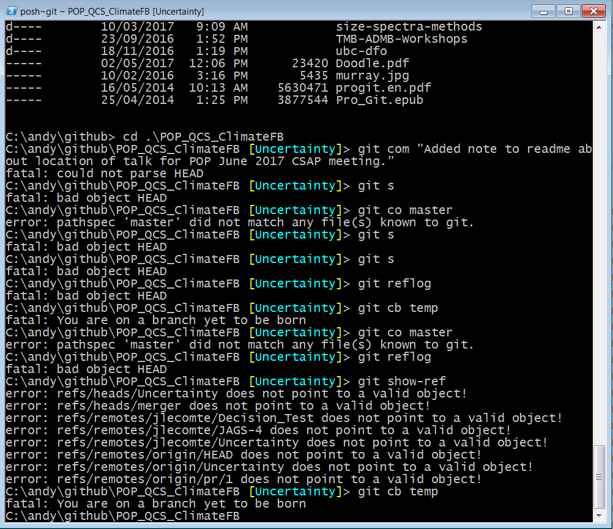
```

I just had to start again from scratch (`clone` again I think). Take-home message:

**Don't mess with the .git directory!!**

### Git terminology

At some point you will likely need to search online for some help (often
questions are posted and answered on the excellent 'stackoverflow' website).
A bit more understanding of terminology will help you.

Remember that Git keeps _commits_.
Several of these commits have pointers to them that have special names:

* **HEAD** points to the commit you are currently on in the Git shell.
* **main** or **master** is the default branch when you set up a repository on
    GitHub (it is usually **main** now because of recent changes on GitHub).

### Branching

So far we have only worked on the **main** branch. Sometimes you want to create
a new branch that branches off from the **main** branch. It's bit like a tree
branching, except that at some point you want your new branch to be merged back
into **main**.

For example, you may want to try adding some new code to your project, but don't
want to break what is already there. You may do this even if working alone, but
it's especially useful if you are collaborating, or if, say, you have an R
packages hosted on GitHub that anyone may be downloading -- you don't want to
annoy them by pushing experimental code that doesn't work.

So you would create a new branch, work on that new branch (i.e. commit
changes to the new branch), and when you are happy with your new changes you can
easily merge it all back into **main**.

**Working on a new branch**

When creating a new branch, your starting point is identical to the branch you
were when you created the new one.

In the Git shell navigate into your test repository:

  `cd test`

Depending on your set up, you should see `main` indicated somewhere (if not do
  `git s` and it should say `On branch main`.

Make sure you are up-to-date and have committed all changes (`git s`, and
  `commit` if necessary).

Create a new branch called _temp_, this will be based off the latest commit of the  _main_
  branch you are currently on:

  `git checkout -b temp`

(We have an alias for that: `  `git cb temp`).

You will be automatically placed in the new branch called _temp_, and commits
  you make will now occur in that branch only.

Make and `commit` some changes (e.g. add a new file) -- these will now be on
  your _temp_ branch.

You can push to GitHub. The first time you try `git p`, the Git shell will
  tell you that you need to type the following so that future pushes go to the
  new branch:

`git --set-upstream origin BRANCH-NAME`

Check the GitHub webpage to see that your branch was pushed. You repository
  page (that will still be looking at your _main_ branch) may tell you that
  there is a _temp_ branch with more recent commits than _main_. If not then if
  you click on the _main_ drop-down menu:

```{r, echo = FALSE, fig.alt = "Example of clicking on main drop-down menu on GitHub to view other branches.", width="100%", fig.align = "center"}
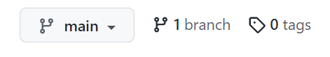
```

it should give you the option to look at your new _temp_ branch. (The '1 branch'
in the above image should also say '2 branches').

You can now view your new file in your new _temp_ branch on GitHub.

A graphical way to see and understand branching is to click on
  Insights--Network to see the Network graph.

The Network Graph is a useful visualization tool, where each commit is shown as
a point on the graph (the numbers along the top are the dates). You can hover
your mouse over a commit to see who committed it and the commit message. You can
click to see full details of the commit. The Network Graph is particularly
useful if you or others are working on multiple branches, or to check details
about merges.

Okay, back in your Git shell you can easily switch back to your original _main_
branch:

`git checkout main` (or the alias `git co main`).

You will see that the file you just added is gone, because it
`r colorize ("only exists in the _temp_ branch")`
at this moment.

Imagine that in your _temp_ branch you did several commits to create a new
function in your code, or have added some new text to a report. Now you are
happy with what you've done you want to merge it back into the _main_ branch.

To view all local branches:

`git branch`

There is an asterisk next to the branch you are currently in.

To switch to another branch (_main_ in our case):

`git checkout main`

To combine the changes from the _temp_ branch:

`git rebase temp`

or

`git merge temp`

Now the file you created in the _temp_ branch now appears in the _main_
branch. All commits done in the _temp_ branch will now be in the _main_ branch
as well.

If there was a merge conflict, you must fix it at this point (see earleir).

Once you've merged your _temp_ branch into _main_, you don't really need _temp_
any more and so it is good protocol to delete to keep things tidy:

`git branch -d temp`

If you have unmerged changes in a branch, you will not be allowed to delete it,
but Git shell will tell you the command to forcibly delete it:

`git branch -D temp`

Warning -- you won't be able to get any of those changes back once you do this.

To remove a branch entirely from GitHub:

`git p origin --delete BRANCH-NAME`

### Pull requests

You often hear about 'Pull requests', but in my workflow I've rarely used
them. A pull request is when a
contributor asks a maintainer of a Git repository to review code the contributor
wants merged into the repository. It's not really used when collaborating with your
own team, but more when you have started with someone else's repository and
either made a branch or forked it, made some improvements (you hope!), and then
you request that they pull your improvements into their main repository. So
fairly advanced. For more details see [here](https://docs.github.com/en/github/collaborating-with-pull-requests/proposing-changes-to-your-work-with-pull-requests/about-pull-requests){target="_blank"}.


### Undoing stuff

**Undoing committed changes**

If you want to undo your previous commit, then use _revert_:

`git revert HEAD`

This actually creates a new commit with the automatic message

`Revert "<previous commit message>"`.

(So you can always revert your revert if you have to! Nothing committed  is lost).

If you make a commit followed by other commits, then realize you want to undo the earlier commit, you use:

`git revert HASH`

where `HASH` is the hash for the commit you want to undo. Remember that Git shell is smart enough that you only need the first five digits:

`git revert 1ef1d`

Obviously, you have to be careful with this if you're changing something that
was a few commits back, as you might mess up your code.

Note that the word
_revert_ is slightly confusing here -- to me it's really an _undo_ of your
earlier commit. It is _not_ reverting back to the earlier state of everything at
that commit, for that you use `git checkout` as discussed above.

**Undoing changes not yet committed**

If you've made a mess in your working directory and you want to change
everything back to the way it was on the last commit:

`git reset --hard HEAD`

If you've messed up a single file and just want that one file to go back to the way it was on the last commit:

`git checkout HEAD <filename_to_restore>`

Warning -- running these commands will delete the changes you have made. Since
you have not committed any changes, they will be lost. Make sure you are certain
you don't need the changes before running these commands. If you aren't sure if
you need the changes again in the future, use `git stash` instead.

**Changing the commit message in the last commit**

If you make a commit then realize you want to change it (add more information,
fix something that will confuse your colleagues, fix something that will confuse
you tomorrow), you can change the commit message:

`git commit --amend -m "Correct message."`

This only works on the last commit.

If you already pushed the commit before realizing that the message needs modification, do this:

`git p --force`

after making the amendment to the commit message.

### Using R and GitHub within RStudio

If you use RStudio to work in R, then you
may want to use RStudio to use Git. Having already learnt the basic Git commands in a
shell should help you.

One way of using Git in RStudio is just to use the commands we have learnt
within the 'Terminal':

```{r, echo = FALSE, fig.alt = "Example screenshot of using Git in the RStudio terminal.", width="100%", fig.align = "center"}
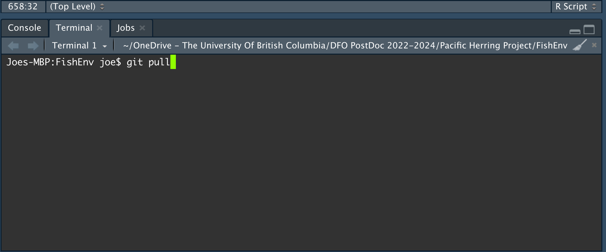
```

Alternatively, the RStudio interface has buttons with words that you are now familiar with, such as
'Diff' and 'Commit':

```{r, echo = FALSE, fig.alt = "Screenshot of the Git buttons in RStudio.", width="100%", fig.align = "center"}
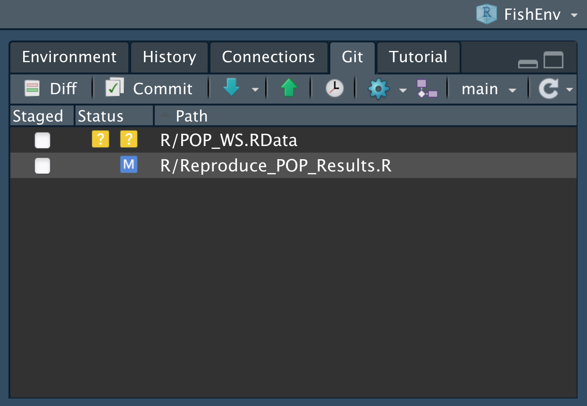
```
The blue arrow has options for fetching from GitHub, while the green arrow
is for pushing to GitHub.

When you commit, instead of including the message in the Git
command like we did, with `git com "<Message>"`, RStudio opens a window:

```{r, echo = FALSE, fig.alt = "Screenshot of the Git commit message window in RStudio.", width="100%", fig.align = "center"}
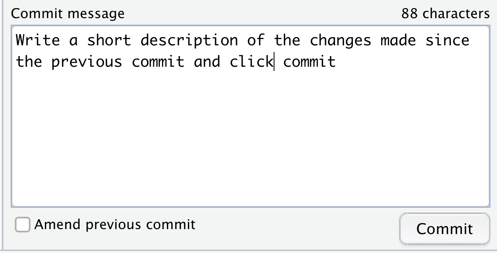
```

As you can see, having learnt what these various Git commands mean, it may be fairly
intuitive how to proceed.

To delve further, Jenny Bryan's [Happy Git and GitHub for the
useR](https://happygitwithr.com/index.html){target="_blank"} course introduces using Git in
RStudio. It was originally developed for advanced-level statistics courses and
is aimed at intermediate to advanced R users. It does include some use of a
shell (like our module); for details on pre-requisites see
[here](https://happygitwithr.com/big-picture.html#audience-and-pre-reqs){target="_blank"}.
Having worked through our Git and GitHub module, you should
easily be able to pick up the necessary components that you need.

In this module's videos that had R code, I was using the Emacs text editor. I've
used it for years for many reasons: it automatically
highlights code in any language, is extremely versatile, has keyboard shortcuts
which you can learn once and use forever, and as such it is
fast to use when programming and
avoids lots of mouse use (which can help avoid repetitive strain
injury). I run R in Emacs with Emacs Speaks Statistics, and often use magit which is a
way of using Git in Emacs. Also, enhancements to Emacs can improve
[accessibility](https://www.emacswiki.org/emacs/CategoryAccessibility){target="_blank"} for those
that need it; for example, Emacs' customisability can [greatly improve productivity
for visually impaired programmers](https://emacsconf.org/2019/talks/08/){target="_blank"}.

Finally, one colleague use RStudio to run R, Emacs to edit R files, and
magit (in Emacs) to run Git. You will likely similarly figure out what setup works best
for you.

### Feedback

We value your input! Please take the time to let us know how we might improve
these materials using [this survey](https://forms.gle/vLkcZq7NxPb2ajTQ6){target="_blank"}.
